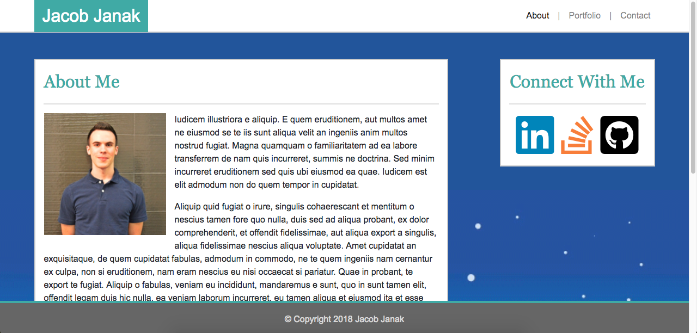

# Bootstrap Portfolio Example

An example of a simple, mobile-responsive portfolio made with Bootstrap 4. I created this for my students at the UCSD coding bootcamp to help them with a homework assignment. Bootstrap 4 is still in its beta version at the time of me making this so I had to write a script to do some of the things Bootstrap is supposed to do, such as moving the page content down when a user opens the collapsed menu on mobile screen sizes.

https://jacobjanak.github.io/Bootstrap-Portfolio-Example/

